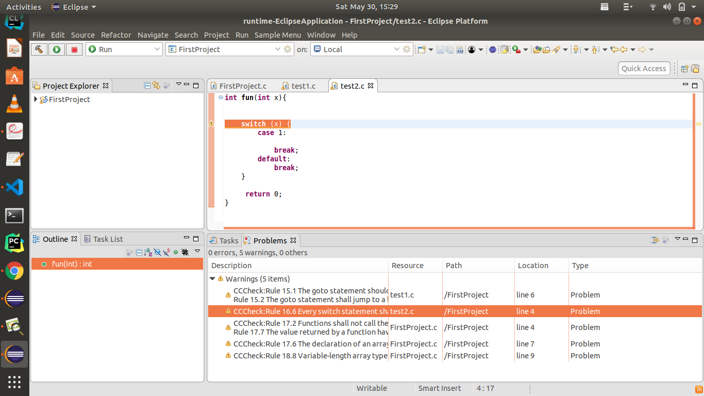

# Eclipse plugin user manual 

 

you have to check out the project from the following repository 

https://github.com/sunilsarode/eclipse_plugin.git  

 

This project is tested for following eclipse versions   

 

Version: Oxygen.3a Release (4.7.3a) 

Build id: 20180405-1200 

 

Version: Eclipse 2019-12 (4.14) 

 

you can check the available and deprecated eclipse versions using the following link 

https://en.wikipedia.org/wiki/Eclipse_(software) 

 

if your eclipse version is still supported by eclipse.org, you can check out this project but the only thing is that you have to take care of dependencies. 

you can see below is the image of the plugin.xml file. you can see the dependency tab is open. 

These are the dependencies for eclipse Version: Oxygen.3a Release (4.7.3a) 

you can use the add button to add dependencies according to your eclipse version. 

Make sure that you write the correct name of the package to find the dependency.

 

the following image shows the difference in dependencies, left part is for the eclipse version Oxygen and the right one is for version Eclipse 2019-12 (4.14) 

# Adding CCChekre path and warning.json file path to the config.txt 

open the config.txt and add the path of the CCChecker tool and path of warning.json. It must be one after another as shown in the image

Now you can run the project using the green run button (Run Eclipse application) 

It will open a new eclipse window, create a new c project.  

you can follow this link to create new c project in eclipse 

https://help.eclipse.org/2019-12/index.jsp?topic=%2Forg.eclipse.cdt.doc.user%2Ftasks%2Fcdt_t_new_cpp.htm 

# Now you have c files in your c project. make sure that there is no compiler error in your code. because the CCCheker tool required compiler error-free c files to apply the checkers. 

# if there is any compile-time error, plugin will remove all markers, because the CCCheker is generating ill form output JSON file (warning.json file) 

Now To run the plugin or to apply it to any c file open in the editor, click on sample menu and then sample command as shown below. 

now you type your code and when you save the code, the plugin will show markers with warnings for your current code editor. 

try to write complier error-free code so the plugin will read the proper warning from the CCChecker. 
  
To see the warnings from all open editors, open problem view 

Window->Show View ->problems   

you can see all warnings from all editors and you click on the specific warning to navigate to that editor 

